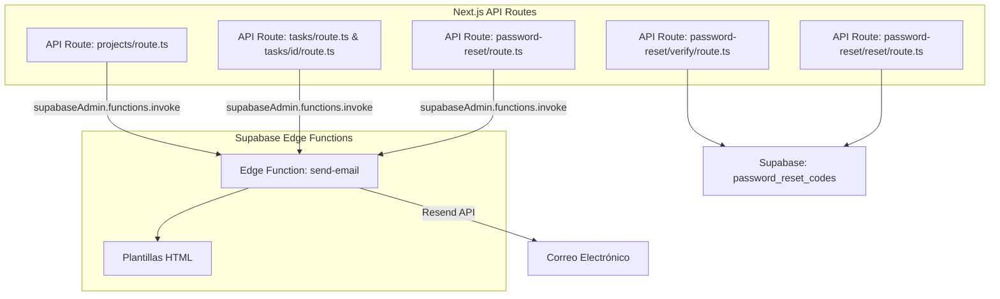

# Diseño: Notificaciones por Correo con Resend

## Visión General

Este diseño describe la implementación de notificaciones por correo electrónico transaccional en SynchroManage usando Resend como proveedor. La arquitectura se basa en una Supabase Edge Function centralizada (`send-email`) que recibe solicitudes desde las API routes existentes de Next.js. Además, se implementa un flujo completo de recuperación de contraseña con código de verificación de 6 dígitos.

### Decisiones de Diseño Clave

1. **Edge Function vs API Route**: Se usa una Supabase Edge Function (Deno) para el envío de correos porque permite aislar la lógica de email del servidor Next.js, mantener la clave de Resend solo en el entorno de Supabase, y escalar independientemente.
2. **Invocación desde API Routes**: Las API routes existentes (`tasks/route.ts`, `projects/route.ts`) invocarán la Edge Function usando `supabaseAdmin.functions.invoke()` después de completar sus operaciones principales. Los errores de email no bloquean la operación principal.
3. **Deduplicación por user ID**: Antes de invocar la Edge Function, las API routes deduplicarán destinatarios por `user_id` para evitar correos duplicados a usuarios multirol.
4. **HTML inline**: Las plantillas de email se generan como HTML inline dentro de la Edge Function, sin dependencias externas de templating.

## Arquitectura



## Componentes e Interfaces

### 1. Supabase Edge Function: `send-email`

**Ubicación**: `supabase/functions/send-email/index.ts`

**Runtime**: Deno (Supabase Edge Functions)

**Interfaz de entrada** (JSON body):
```typescript
interface SendEmailRequest {
  to: string           // Email del destinatario
  subject: string      // Asunto del correo
  type: 'project_assigned' | 'task_assigned' | 'password_reset'
  data: ProjectAssignedData | TaskAssignedData | PasswordResetData
}

interface ProjectAssignedData {
  recipientName: string
  projectName: string
  roles: string[]        // Ej: ["Project Manager", "Desarrollador"]
  projectUrl: string
}

interface TaskAssignedData {
  recipientName: string
  taskName: string
  projectName: string
  priority: string
  taskUrl: string
}

interface PasswordResetData {
  recipientName: string
  code: string           // Código de 6 dígitos
}
```

**Respuestas**:
- `200`: `{ success: true, id: string }` (ID del email en Resend)
- `400`: `{ error: string }` (parámetros inválidos)
- `500`: `{ error: string }` (error de Resend API)

**Lógica**:
1. Validar que `to` no esté vacío y tenga formato de email válido (regex básico)
2. Validar que `type` sea uno de los tipos soportados
3. Generar HTML según `type` usando la función de plantilla correspondiente
4. Enviar vía `fetch` a `https://api.resend.com/emails` con header `Authorization: Bearer ${RESEND_API_KEY}`
5. Retornar resultado o error

### 2. Funciones de utilidad para deduplicación de destinatarios

**Ubicación**: `src/lib/utils/email-recipients.ts`

```typescript
interface EmailRecipient {
  userId: string
  email: string
  fullName: string
  roles: string[]
}

/**
 * Deduplica destinatarios de email por userId, consolidando roles.
 * Excluye al usuario que realiza la acción (currentUserId).
 */
function deduplicateRecipients(
  recipients: Array<{ userId: string; email: string; fullName: string; role: string }>,
  currentUserId: string
): EmailRecipient[]
```

### 3. API Routes de Recuperación de Contraseña

**3a. `POST /api/auth/password-reset`** — Solicitar código
- Recibe `{ email: string }`
- Busca usuario en `profiles` por email
- Si no existe, retorna 200 genérico (no revelar existencia)
- Si existe: genera código de 6 dígitos, invalida códigos previos, inserta en `password_reset_codes`, invoca Edge Function
- Retorna 200 con mensaje genérico

**3b. `POST /api/auth/password-reset/verify`** — Verificar código
- Recibe `{ email: string, code: string }`
- Busca código válido y no expirado en `password_reset_codes`
- Retorna `{ valid: true }` o error 400

**3c. `POST /api/auth/password-reset/reset`** — Establecer nueva contraseña
- Recibe `{ email: string, code: string, password: string }`
- Verifica código nuevamente
- Usa `supabaseAdmin.auth.admin.updateUserById()` para cambiar contraseña
- Elimina código usado de `password_reset_codes`
- Retorna 200

### 4. Página de Recuperación de Contraseña

**Ubicación**: `src/app/auth/forgot-password/page.tsx`

Componente cliente con 3 pasos:
1. **Paso 1**: Formulario de email → llama a `/api/auth/password-reset`
2. **Paso 2**: Formulario de código de 6 dígitos → llama a `/api/auth/password-reset/verify`
3. **Paso 3**: Formulario de nueva contraseña + confirmación → llama a `/api/auth/password-reset/reset`

### 5. Modificaciones a API Routes Existentes

**`src/app/api/dashboard/projects/route.ts` (POST)**:
- Después de crear proyecto y notificaciones internas, recopilar destinatarios (PM, Tech Lead, miembros)
- Deduplicar por userId usando `deduplicateRecipients()`
- Invocar Edge Function para cada destinatario único

**`src/app/api/dashboard/tasks/route.ts` (POST)**:
- Después de crear tarea y notificaciones internas, invocar Edge Function para cada asignado (excluyendo creador)

**`src/app/api/dashboard/tasks/[id]/route.ts` (PUT)**:
- Después de actualizar tarea, invocar Edge Function solo para nuevos asignados (`addedIds`)


## Modelos de Datos

### Tabla existente: `password_reset_codes`

```sql
CREATE TABLE password_reset_codes (
  id UUID DEFAULT gen_random_uuid() PRIMARY KEY,
  user_id UUID NOT NULL REFERENCES auth.users(id) ON DELETE CASCADE,
  code VARCHAR(6) NOT NULL,
  expires_at TIMESTAMPTZ NOT NULL,
  used BOOLEAN DEFAULT FALSE,
  created_at TIMESTAMPTZ DEFAULT NOW()
);

CREATE INDEX idx_password_reset_codes_user_id ON password_reset_codes(user_id);
CREATE INDEX idx_password_reset_codes_lookup ON password_reset_codes(user_id, code, used);
```

### Tablas existentes referenciadas

- `profiles`: `id`, `email`, `full_name`, `role_id`
- `projects`: `id`, `name`, `pm_id`, `tech_lead_id`
- `project_members`: `project_id`, `user_id`, `role`
- `tasks`: `id`, `title`, `project_id`, `priority`
- `task_assignees`: `task_id`, `user_id`
- `user_roles`: `user_id`, `role_id` (para deduplicación multirol)

### Tipos TypeScript

```typescript
// Tipos para la Edge Function
type NotificationType = 'project_assigned' | 'task_assigned' | 'password_reset'

interface SendEmailPayload {
  to: string
  subject: string
  type: NotificationType
  data: Record<string, unknown>
}

// Tipo para deduplicación
interface EmailRecipient {
  userId: string
  email: string
  fullName: string
  roles: string[]
}

// Tipo para código de verificación
interface PasswordResetCode {
  id: string
  user_id: string
  code: string
  expires_at: string
  used: boolean
  created_at: string
}
```

### Variables de Entorno

| Variable | Ubicación | Descripción |
|---|---|---|
| `RESEND_API_KEY` | Supabase Edge Function secrets | Clave API de Resend: `re_RzzWmAy5_4yJASak8q4zwy5bgfQB29ac8` |
| `NEXT_PUBLIC_APP_URL` | Next.js `.env.local` | URL base de la app para generar enlaces en emails |
| `NEXT_PUBLIC_SUPABASE_URL` | Next.js `.env.local` | Ya existente |
| `SUPABASE_SERVICE_ROLE_KEY` | Next.js `.env.local` | Ya existente, necesario para `functions.invoke()` |


## Propiedades de Correctitud

*Una propiedad es una característica o comportamiento que debe mantenerse verdadero en todas las ejecuciones válidas de un sistema — esencialmente, una declaración formal sobre lo que el sistema debe hacer. Las propiedades sirven como puente entre especificaciones legibles por humanos y garantías de correctitud verificables por máquina.*

### Propiedad 1: Validación de entrada rechaza emails y tipos inválidos

*Para cualquier* string que no sea un email válido (vacío, sin @, sin dominio, etc.) O cualquier string de tipo de notificación que no sea `project_assigned`, `task_assigned` o `password_reset`, la función de validación de la Edge Function debe rechazar la solicitud retornando un error, sin intentar el envío.

**Valida: Requisitos 1.5, 1.6**

### Propiedad 2: Deduplicación de destinatarios con consolidación de roles y auto-exclusión

*Para cualquier* lista de destinatarios donde un mismo `userId` aparece múltiples veces (con diferentes roles), y dado un `currentUserId`, la función `deduplicateRecipients` debe retornar una lista donde: (a) cada `userId` aparece exactamente una vez, (b) los roles de entradas duplicadas se consolidan en un array, (c) el `currentUserId` no aparece en el resultado.

**Valida: Requisitos 2.5, 2.6, 3.4, 3.5**

### Propiedad 3: Solo nuevos asignados reciben email al actualizar tarea

*Para cualquier* par de conjuntos de IDs de asignados (actuales A y nuevos B) y un `currentUserId`, la función de cálculo de destinatarios debe retornar exactamente B \ A (diferencia de conjuntos) excluyendo al `currentUserId`. Los usuarios en A ∩ B no deben recibir notificación.

**Valida: Requisitos 3.2**

### Propiedad 4: Plantillas de email contienen todos los campos requeridos por tipo

*Para cualquier* solicitud de email válida con tipo y datos, el HTML generado debe contener: (a) la estructura común (logo SynchroManage, pie de página), y (b) todos los campos específicos del tipo: para `project_assigned` → nombre destinatario, nombre proyecto, rol, enlace; para `task_assigned` → nombre destinatario, nombre tarea, nombre proyecto, prioridad, enlace; para `password_reset` → nombre destinatario, código de verificación, nota de expiración 15 minutos.

**Valida: Requisitos 2.4, 3.3, 5.1, 5.2, 5.3, 5.4**

### Propiedad 5: Código de verificación es de 6 dígitos numéricos

*Para cualquier* invocación de la función de generación de código, el resultado debe ser un string de exactamente 6 caracteres donde cada carácter es un dígito del 0 al 9.

**Valida: Requisitos 4.1**

### Propiedad 6: Expiración del código de verificación es de 15 minutos

*Para cualquier* código generado, el campo `expires_at` debe ser exactamente 15 minutos después del momento de creación (con tolerancia de ±1 segundo).

**Valida: Requisitos 4.2**

### Propiedad 7: Códigos inválidos o expirados son rechazados

*Para cualquier* código que no coincida con el almacenado O cuyo `expires_at` sea anterior al momento actual, la función de verificación debe retornar un resultado de fallo indicando que el código es inválido o ha expirado.

**Valida: Requisitos 4.6**

### Propiedad 8: Solicitar nuevo código invalida los anteriores

*Para cualquier* usuario con N códigos previos no usados, al generar un nuevo código, todos los N códigos previos deben quedar marcados como usados/inválidos, y solo el nuevo código debe ser válido.

**Valida: Requisitos 4.7**

## Manejo de Errores

| Escenario | Comportamiento | Código HTTP |
|---|---|---|
| Email del destinatario vacío o inválido | Edge Function retorna error sin intentar envío | 400 |
| Tipo de notificación no soportado | Edge Function retorna error descriptivo | 400 |
| Resend API retorna error | Log del error, retorna mensaje descriptivo | 500 |
| Error al invocar Edge Function desde API Route | Log del error, la operación principal (crear proyecto/tarea) NO se revierte | 200 (operación principal exitosa) |
| Email no encontrado en recuperación de contraseña | Respuesta genérica de éxito (seguridad) | 200 |
| Código de verificación incorrecto | Mensaje de error: "Código inválido o expirado" | 400 |
| Código de verificación expirado | Mensaje de error: "Código inválido o expirado" | 400 |
| Error al cambiar contraseña en Supabase Auth | Mensaje de error descriptivo | 500 |

### Principio de no-bloqueo

Los errores de envío de email nunca deben bloquear la operación principal. Si la Edge Function falla, se registra el error en logs pero la respuesta de la API route sigue siendo exitosa para la operación de negocio (crear proyecto, crear tarea, etc.).

## Estrategia de Testing

### Testing Unitario

- Validación de email (formato válido/inválido)
- Validación de tipo de notificación
- Generación de código de 6 dígitos
- Cálculo de expiración
- Verificación de código (válido, inválido, expirado)
- Deduplicación de destinatarios
- Generación de HTML de plantillas (contiene campos requeridos)

### Testing basado en Propiedades

Se usará **fast-check** (ya instalado en el proyecto) con **vitest** para implementar las propiedades de correctitud.

Configuración:
- Mínimo 100 iteraciones por test de propiedad
- Cada test debe referenciar la propiedad del documento de diseño
- Formato de tag: **Feature: email-notifications-resend, Property {número}: {texto de la propiedad}**

Cada propiedad de correctitud se implementará como un ÚNICO test basado en propiedades:

1. **Propiedad 1** → Generar strings aleatorios y verificar que los inválidos son rechazados por la validación
2. **Propiedad 2** → Generar listas aleatorias de destinatarios con duplicados y verificar deduplicación + consolidación + auto-exclusión
3. **Propiedad 3** → Generar pares aleatorios de conjuntos de IDs y verificar que el resultado es exactamente la diferencia de conjuntos menos el currentUserId
4. **Propiedad 4** → Generar datos aleatorios para cada tipo de notificación y verificar que el HTML contiene todos los campos requeridos
5. **Propiedad 5** → Generar múltiples códigos y verificar formato de 6 dígitos numéricos
6. **Propiedad 6** → Generar códigos con timestamps y verificar que la expiración es 15 minutos
7. **Propiedad 7** → Generar códigos con diferentes estados (correcto/incorrecto, expirado/vigente) y verificar rechazo de inválidos
8. **Propiedad 8** → Generar secuencias de códigos para un usuario y verificar que solo el último es válido

### Testing de Integración (manual/E2E)

- Flujo completo de creación de proyecto → recepción de email
- Flujo completo de asignación de tarea → recepción de email
- Flujo completo de recuperación de contraseña (solicitar → verificar → cambiar)
- Verificar que la Edge Function se despliega correctamente en Supabase

