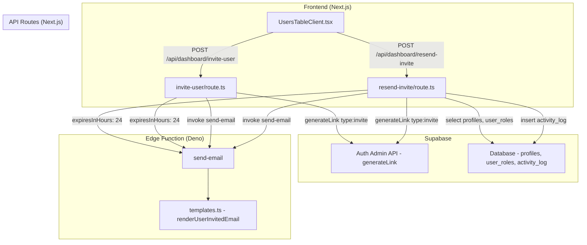

# Documento de Diseño: Expiración y Reenvío de Invitaciones

## Visión General

Este diseño describe las modificaciones necesarias para (1) informar en el correo de invitación que el enlace expira en 24 horas, y (2) permitir a los administradores reenviar invitaciones a usuarios pendientes desde la tabla de gestión de usuarios.

### Cambios principales

1. Extender la interfaz `UserInvitedData` con un campo opcional `expiresInHours` (tipo `number`).
2. Actualizar `renderUserInvitedEmail()` para mostrar el aviso de expiración debajo del botón "Aceptar Invitación".
3. Modificar la API de invitación (`invite-user/route.ts`) para enviar `expiresInHours: 24` en los datos del correo.
4. Crear un nuevo endpoint `POST /api/dashboard/resend-invite` que regenera el enlace y reenvía el correo.
5. Agregar un botón de reenvío en `UsersTableClient.tsx` visible solo para usuarios pendientes.

### Decisiones de diseño

- **Campo opcional `expiresInHours`**: Se usa un campo opcional para mantener retrocompatibilidad. Si no se envía, el template muestra "24 horas" por defecto. Esto evita romper invocaciones existentes.
- **Endpoint separado para reenvío**: Se crea `/api/dashboard/resend-invite` en lugar de reutilizar `/api/dashboard/invite-user` porque el reenvío opera sobre un usuario ya existente (busca por ID), mientras que la invitación original crea el usuario.
- **Reutilización de `generateLink({ type: 'invite' })`**: Supabase permite llamar `generateLink` múltiples veces para el mismo email, generando un nuevo enlace con nueva expiración. El usuario existente no se duplica.
- **Botón inline en la tabla**: Se implementa como un `Button` con ícono directamente en la fila, sin diálogo de confirmación, ya que reenviar una invitación es una acción no destructiva.

## Arquitectura



### Flujo de reenvío

1. El admin hace clic en el botón de reenvío en la fila de un usuario pendiente.
2. El frontend envía `POST /api/dashboard/resend-invite` con `{ userId }`.
3. El endpoint verifica autenticación y rol admin.
4. Busca el perfil del usuario y verifica que no haya confirmado su email.
5. Llama a `supabaseAdmin.auth.admin.generateLink({ type: 'invite', email })` para generar un nuevo enlace.
6. Invoca la Edge Function `send-email` con tipo `user_invited` y los datos del usuario (incluyendo `expiresInHours: 24`).
7. Registra la acción `invite_resent` en `activity_log`.
8. Retorna éxito al frontend, que muestra un toast de confirmación.

## Componentes e Interfaces

### Archivo: `supabase/functions/send-email/templates.ts` (modificado)

Cambios en la interfaz y función de renderizado:

```typescript
// Interfaz extendida
export interface UserInvitedData {
  recipientName: string
  inviteUrl: string
  roles: string[]
  expiresInHours?: number  // Nuevo campo opcional
}

// renderUserInvitedEmail actualizado para incluir aviso de expiración
// El aviso se posiciona después del botón "Aceptar Invitación" y antes del texto de descarte
```

### Archivo: `src/app/api/dashboard/resend-invite/route.ts` (nuevo)

```typescript
// POST handler
// 1. Verifica autenticación y rol admin (mismo patrón que invite-user)
// 2. Recibe { userId } del body
// 3. Busca perfil del usuario con roles
// 4. Verifica que el usuario existe (404 si no)
// 5. Verifica que no ha confirmado email via auth.admin.getUserById (400 si ya confirmó)
// 6. Llama generateLink({ type: 'invite', email })
// 7. Invoca send-email con tipo user_invited
// 8. Registra en activity_log con acción "invite_resent"
// 9. Retorna { success: true }
```

### Archivo: `src/app/api/dashboard/invite-user/route.ts` (modificado)

Cambio mínimo: agregar `expiresInHours: 24` al objeto `data` enviado a la Edge Function.

```typescript
// En la invocación de send-email, agregar:
data: {
  recipientName: full_name,
  inviteUrl,
  roles: roleNames,
  expiresInHours: 24,  // Nuevo
}
```

### Archivo: `src/components/dashboard/users/UsersTableClient.tsx` (modificado)

Cambios en el componente:

- Agregar estado `resendingUserId` para rastrear qué usuario está en proceso de reenvío.
- Agregar función `handleResendInvite(userId)` que llama al endpoint.
- En la columna de acciones, renderizar un botón de reenvío (ícono `RefreshCw` de lucide-react) condicionalmente cuando `!user.email_confirmed`.
- Mostrar toast/notificación de éxito o error.

## Modelos de Datos

### Interfaz `UserInvitedData` (extendida)

```typescript
export interface UserInvitedData {
  recipientName: string
  inviteUrl: string
  roles: string[]
  expiresInHours?: number  // Nuevo: horas hasta expiración del enlace
}
```

### Request body del endpoint de reenvío

```typescript
interface ResendInviteRequest {
  userId: string  // UUID del usuario pendiente
}
```

### Response del endpoint de reenvío

```typescript
// Éxito (200)
{ success: true }

// Errores
{ error: "No autorizado" }           // 401
{ error: "No tienes permisos" }      // 403
{ error: "Usuario no encontrado" }   // 404
{ error: "El usuario ya confirmó su cuenta" }  // 400
{ error: string }                    // 500
```

### Registro en `activity_log`

```typescript
{
  user_id: adminUserId,       // Quien ejecutó la acción
  action: 'invite_resent',    // Nueva acción
  entity_type: 'user',
  entity_id: targetUserId,
  entity_name: targetFullName,
}
```


## Propiedades de Corrección

*Una propiedad es una característica o comportamiento que debe cumplirse en todas las ejecuciones válidas de un sistema — esencialmente, una declaración formal sobre lo que el sistema debe hacer. Las propiedades sirven como puente entre especificaciones legibles por humanos y garantías de corrección verificables por máquina.*

### Propiedad 1: El correo de invitación contiene aviso de expiración correctamente posicionado

*Para cualquier* `UserInvitedData` válido con roles no vacíos, el HTML generado por `renderUserInvitedEmail()` debe contener un texto indicando la expiración del enlace, y dicho texto debe aparecer después del botón "Aceptar Invitación" y antes del texto "Si no esperabas esta invitación".

**Validates: Requirements 1.1, 1.2**

### Propiedad 2: El valor de expiresInHours se refleja en el correo

*Para cualquier* `UserInvitedData` válido con un campo `expiresInHours` numérico positivo, el HTML generado por `renderUserInvitedEmail()` debe contener ese valor numérico en el texto de expiración. Cuando `expiresInHours` no está presente, el texto debe mostrar "24 horas" como valor por defecto.

**Validates: Requirements 1.3, 1.4**

### Propiedad 3: La API de reenvío rechaza solicitudes de usuarios no-admin

*Para cualquier* usuario autenticado cuyo rol no sea `admin`, la API de reenvío debe responder con código HTTP 403 y el mensaje "No tienes permisos".

**Validates: Requirements 3.3, 3.4**

## Manejo de Errores

### Endpoint de reenvío (`/api/dashboard/resend-invite`)

| Condición | Código HTTP | Mensaje |
|---|---|---|
| Usuario no autenticado | 401 | "No autorizado" |
| Solicitante no es admin | 403 | "No tienes permisos" |
| `userId` no proporcionado | 400 | "Falta el identificador del usuario" |
| Usuario no encontrado en profiles | 404 | "Usuario no encontrado" |
| Usuario ya confirmó su email | 400 | "El usuario ya confirmó su cuenta" |
| `generateLink` falla | 500 | Mensaje del error de Supabase |
| Error de envío de email | 200 (no falla) | Se loguea el error pero el reenvío se considera exitoso (el enlace ya fue regenerado) |
| Error interno inesperado | 500 | "Error interno del servidor" |

### Template de correo

- Si `expiresInHours` no está presente en `UserInvitedData`, se usa 24 como valor por defecto. No se lanza error.
- Si `roles` es un array vacío, se muestra cadena vacía para los roles (validación ocurre en capas superiores).

### Frontend

- Si el reenvío falla, se muestra el mensaje de error recibido del API en un toast.
- Si el reenvío tiene éxito, se muestra un toast de confirmación.
- El botón se deshabilita durante la solicitud para evitar doble envío.

## Estrategia de Testing

### Enfoque dual: Tests unitarios + Tests de propiedad

- **Tests de propiedad (fast-check)**: Verifican las 3 propiedades de corrección definidas arriba, generando datos aleatorios. Mínimo 100 iteraciones por propiedad.
- **Tests unitarios (Vitest)**: Verifican casos específicos, edge cases y condiciones de error del endpoint.

### Configuración de tests de propiedad

- **Librería**: `fast-check` (ya instalada en el proyecto)
- **Framework**: Vitest
- **Iteraciones**: Mínimo 100 por test (`{ numRuns: 100 }`)
- **Ubicación**: `src/lib/utils/__tests__/invitationExpiry.property.test.ts` (nuevo)
- **Importación**: Desde `supabase/functions/send-email/templates.ts` (funciones puras, sin dependencias Deno)
- **Etiquetado**: Cada test debe incluir un comentario con formato: `Feature: invitation-expiry-resend, Property {N}: {descripción}`

### Tests de propiedad planificados

| Test | Propiedad | Descripción |
|---|---|---|
| 1 | Propiedad 1 | Genera `UserInvitedData` aleatorio, verifica que el aviso de expiración existe y está posicionado entre el botón CTA y el texto de descarte |
| 2 | Propiedad 2 | Genera `UserInvitedData` con `expiresInHours` aleatorio (1-168), verifica que el valor aparece en el HTML. También genera sin el campo y verifica "24 horas" por defecto |
| 3 | Propiedad 3 | Test de integración con mock de Supabase: genera roles no-admin aleatorios, verifica respuesta 403 |

### Tests unitarios planificados

| Test | Descripción |
|---|---|
| 1 | Endpoint de reenvío retorna 404 para userId inexistente |
| 2 | Endpoint de reenvío retorna 400 para usuario ya confirmado |
| 3 | Endpoint de reenvío retorna 401 sin autenticación |
| 4 | Endpoint de reenvío retorna 200 y registra actividad para caso exitoso |
| 5 | Template de invitación con `expiresInHours: undefined` muestra "24 horas" |
| 6 | API de invitación original incluye `expiresInHours: 24` en los datos del correo |

### Cada propiedad de corrección DEBE ser implementada por UN SOLO test de propiedad

No se deben dividir las propiedades en múltiples tests. Cada test de propiedad corresponde exactamente a una propiedad del documento de diseño.
