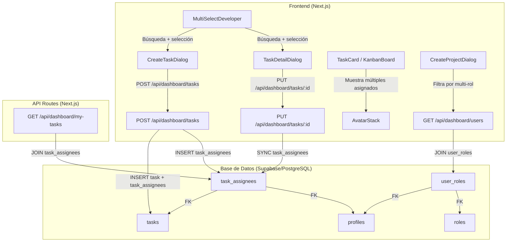

# Documento de Diseño: Multi-Rol y Multi-Desarrollador

## Visión General

Este diseño extiende el sistema de gestión de proyectos para soportar dos capacidades principales:

1. **Multi-Rol por Usuario**: Los usuarios pueden tener múltiples roles simultáneamente (ej: un usuario puede ser PM y developer). El rol de mayor jerarquía determina los permisos, pero el usuario aparece en todos los selectores correspondientes a sus roles.

2. **Multi-Asignado por Tarea**: Las tareas pueden asignarse a múltiples desarrolladores en lugar de uno solo, con un componente de selección múltiple con búsqueda por nombre.

### Decisiones de Diseño Clave

- **Tablas de unión**: Se crean `user_roles` y `task_assignees` como tablas de unión para las relaciones N:N.
- **Compatibilidad hacia atrás**: Los campos `role_id` en `profiles` y `assignee_id` en `tasks` se mantienen como deprecados durante la transición, sincronizados con las nuevas tablas.
- **Jerarquía de roles**: `admin > pm > tech_lead > developer > stakeholder` — el rol primario se calcula en el cliente a partir de los roles del usuario.
- **Migraciones via Supabase MCP**: Las migraciones de base de datos se ejecutarán usando el Supabase MCP disponible.

## Arquitectura

### Diagrama de Arquitectura



### Flujo de Datos

1. **Creación de tarea**: El frontend envía un array `assignee_ids: string[]` → la API inserta la tarea y luego inserta registros en `task_assignees`.
2. **Actualización de tarea**: La API compara los asignados actuales con los nuevos, elimina los removidos e inserta los nuevos en `task_assignees`.
3. **Consulta de usuarios por rol**: La API hace JOIN con `user_roles` para obtener todos los usuarios que tengan un rol específico entre sus roles.
4. **Mis tareas**: La API consulta `task_assignees` en lugar de `tasks.assignee_id` para obtener las tareas del usuario actual.


## Componentes e Interfaces

### 1. Tabla `user_roles` (Nueva)

Tabla de unión que relaciona usuarios con múltiples roles.

- **Responsabilidad**: Almacenar la relación N:N entre usuarios y roles.
- **Interacciones**: Consultada por la API de usuarios para filtrar por rol, y por la lógica de permisos para determinar el rol primario.

### 2. Tabla `task_assignees` (Nueva)

Tabla de unión que relaciona tareas con múltiples asignados.

- **Responsabilidad**: Almacenar la relación N:N entre tareas y usuarios asignados.
- **Interacciones**: Consultada por las APIs de tareas para obtener asignados, y por la API de mis-tareas para obtener tareas del usuario.

### 3. Componente `MultiSelectDeveloper` (Nuevo)

Componente React reutilizable de selección múltiple con búsqueda.

- **Props**:
  ```typescript
  interface MultiSelectDeveloperProps {
    members: { id: string; full_name: string; avatar_url: string | null }[]
    selectedIds: string[]
    onSelectionChange: (ids: string[]) => void
    placeholder?: string
    disabled?: boolean
  }
  ```
- **Comportamiento**:
  - Campo de texto para filtrar por nombre (case-insensitive).
  - Lista desplegable que excluye usuarios ya seleccionados.
  - Muestra selecciones como badges con botón de remover (X).
  - Mensaje "No se encontraron usuarios" cuando no hay coincidencias.

### 4. Componente `AvatarStack` (Nuevo)

Componente para mostrar avatares apilados de múltiples asignados.

- **Props**:
  ```typescript
  interface AvatarStackProps {
    assignees: { id: string; full_name: string; avatar_url: string | null }[]
    maxVisible?: number // default: 3
  }
  ```
- **Comportamiento**:
  - Muestra hasta `maxVisible` avatares con superposición (-ml-2).
  - Si hay más de `maxVisible`, muestra indicador "+N" con la cantidad restante.

### 5. Función `getPrimaryRole` (Nueva)

Función utilitaria para determinar el rol primario de un usuario.

```typescript
const ROLE_HIERARCHY: RoleName[] = ['admin', 'pm', 'tech_lead', 'developer', 'stakeholder']

function getPrimaryRole(roles: RoleName[]): RoleName {
  for (const role of ROLE_HIERARCHY) {
    if (roles.includes(role)) return role
  }
  return 'stakeholder' // fallback
}
```

### 6. Función `hasRole` (Nueva)

Función utilitaria para verificar si un usuario tiene un rol específico.

```typescript
function hasRole(userRoles: RoleName[], targetRole: RoleName): boolean {
  return userRoles.includes(targetRole)
}
```

### 7. APIs Modificadas

#### POST /api/dashboard/tasks
- **Cambio**: Acepta `assignee_ids: string[]` en lugar de `assignee_id: string`.
- **Lógica**: Inserta la tarea, luego inserta registros en `task_assignees`. Mantiene `assignee_id` sincronizado con el primer asignado (compatibilidad).

#### PUT /api/dashboard/tasks/[id]
- **Cambio**: Acepta `assignee_ids: string[]`.
- **Lógica**: Compara asignados actuales vs nuevos. Elimina removidos, inserta nuevos en `task_assignees`. Envía notificaciones a nuevos asignados. Registra actividad de desasignación.

#### GET /api/dashboard/tasks/[id]
- **Cambio**: Retorna `assignees: Profile[]` en lugar de `assignee: Profile | null`.
- **Lógica**: Hace JOIN con `task_assignees` y `profiles`.

#### GET /api/dashboard/users
- **Cambio**: Incluye `roles: RoleName[]` (array de todos los roles) además del `role` existente.
- **Lógica**: Hace JOIN con `user_roles` y `roles` para obtener todos los roles del usuario.

#### GET /api/dashboard/my-tasks
- **Cambio**: Consulta `task_assignees` en lugar de filtrar por `tasks.assignee_id`.
- **Lógica**: `SELECT tasks.* FROM tasks INNER JOIN task_assignees ON tasks.id = task_assignees.task_id WHERE task_assignees.user_id = ?`.

#### PATCH /api/dashboard/tasks (drag & drop)
- **Cambio**: Retorna `assignees` en lugar de `assignee` en la respuesta.

### 8. Componentes UI Modificados

#### CreateTaskDialog
- Reemplaza `<Select>` de asignado único por `<MultiSelectDeveloper>`.
- `formData.assignee_id` → `formData.assignee_ids: string[]`.
- Envía notificación a cada nuevo asignado.

#### TaskDetailDialog
- Reemplaza `<Select>` de asignado único por `<MultiSelectDeveloper>`.
- `formData.assignee_id` → `formData.assignee_ids: string[]`.
- Muestra lista completa de asignados con nombre y avatar.

#### TaskCard
- Reemplaza sección de asignado único por `<AvatarStack>`.
- Interface `Task.assignee` → `Task.assignees: Profile[]`.

#### KanbanBoard
- Actualiza interface `Task` para usar `assignees` en lugar de `assignee`.

#### CreateProjectDialog / EditProjectDialog
- Actualiza filtrado de usuarios: en lugar de `users.filter(u => u.role?.name === 'developer')`, usa `users.filter(u => u.roles?.includes('developer'))`.


## Modelos de Datos

### Nuevas Tablas

#### `user_roles`

| Columna    | Tipo      | Restricciones                          |
|------------|-----------|----------------------------------------|
| id         | SERIAL    | PRIMARY KEY                            |
| user_id    | UUID      | NOT NULL, FK → profiles(id) ON DELETE CASCADE |
| role_id    | INTEGER   | NOT NULL, FK → roles(id) ON DELETE CASCADE    |
| created_at | TIMESTAMP | DEFAULT now()                          |

- **Restricción UNIQUE**: `(user_id, role_id)` — un usuario no puede tener el mismo rol duplicado.
- **Índice**: `idx_user_roles_user_id` en `user_id` para consultas rápidas de roles por usuario.
- **RLS**: Habilitado. Lectura para usuarios autenticados, escritura solo para admins.

#### `task_assignees`

| Columna     | Tipo      | Restricciones                          |
|-------------|-----------|----------------------------------------|
| id          | SERIAL    | PRIMARY KEY                            |
| task_id     | UUID      | NOT NULL, FK → tasks(id) ON DELETE CASCADE    |
| user_id     | UUID      | NOT NULL, FK → profiles(id) ON DELETE CASCADE |
| assigned_at | TIMESTAMP | DEFAULT now()                          |

- **Restricción UNIQUE**: `(task_id, user_id)` — un usuario no puede estar asignado dos veces a la misma tarea.
- **Índice**: `idx_task_assignees_task_id` en `task_id` para consultas rápidas de asignados por tarea.
- **Índice**: `idx_task_assignees_user_id` en `user_id` para consultas rápidas de tareas por usuario (my-tasks).
- **RLS**: Habilitado. Lectura para usuarios autenticados, escritura para roles con permiso ASSIGN_TASKS.

### Migración de Datos

```sql
-- 1. Crear tabla user_roles
CREATE TABLE user_roles (
  id SERIAL PRIMARY KEY,
  user_id UUID NOT NULL REFERENCES profiles(id) ON DELETE CASCADE,
  role_id INTEGER NOT NULL REFERENCES roles(id) ON DELETE CASCADE,
  created_at TIMESTAMP WITH TIME ZONE DEFAULT now(),
  UNIQUE(user_id, role_id)
);
CREATE INDEX idx_user_roles_user_id ON user_roles(user_id);

-- 2. Crear tabla task_assignees
CREATE TABLE task_assignees (
  id SERIAL PRIMARY KEY,
  task_id UUID NOT NULL REFERENCES tasks(id) ON DELETE CASCADE,
  user_id UUID NOT NULL REFERENCES profiles(id) ON DELETE CASCADE,
  assigned_at TIMESTAMP WITH TIME ZONE DEFAULT now(),
  UNIQUE(task_id, user_id)
);
CREATE INDEX idx_task_assignees_task_id ON task_assignees(task_id);
CREATE INDEX idx_task_assignees_user_id ON task_assignees(user_id);

-- 3. Poblar user_roles desde profiles.role_id existente
INSERT INTO user_roles (user_id, role_id)
SELECT id, role_id FROM profiles WHERE role_id IS NOT NULL;

-- 4. Poblar task_assignees desde tasks.assignee_id existente
INSERT INTO task_assignees (task_id, user_id)
SELECT id, assignee_id FROM tasks WHERE assignee_id IS NOT NULL;

-- 5. Habilitar RLS
ALTER TABLE user_roles ENABLE ROW LEVEL SECURITY;
ALTER TABLE task_assignees ENABLE ROW LEVEL SECURITY;

-- 6. Políticas RLS para user_roles
CREATE POLICY "Usuarios autenticados pueden leer user_roles"
  ON user_roles FOR SELECT
  TO authenticated
  USING (true);

CREATE POLICY "Solo admins pueden modificar user_roles"
  ON user_roles FOR ALL
  TO authenticated
  USING (
    EXISTS (
      SELECT 1 FROM profiles p
      JOIN roles r ON p.role_id = r.id
      WHERE p.id = auth.uid() AND r.name = 'admin'
    )
  );

-- 7. Políticas RLS para task_assignees
CREATE POLICY "Usuarios autenticados pueden leer task_assignees"
  ON task_assignees FOR SELECT
  TO authenticated
  USING (true);

CREATE POLICY "Roles con permiso pueden modificar task_assignees"
  ON task_assignees FOR ALL
  TO authenticated
  USING (
    EXISTS (
      SELECT 1 FROM profiles p
      JOIN roles r ON p.role_id = r.id
      WHERE p.id = auth.uid() AND r.name IN ('admin', 'pm', 'tech_lead')
    )
  );
```

### Tipos TypeScript Actualizados

```typescript
// src/lib/types/roles.ts - Adiciones

export interface UserRole {
  user_id: string
  role_id: number
  role?: Role
}

export interface ProfileWithRoles extends Profile {
  roles: RoleName[]       // Todos los roles del usuario
  user_roles?: UserRole[] // Relación completa (para admin)
}

export interface TaskAssignee {
  id: string
  full_name: string
  avatar_url: string | null
}

// Jerarquía de roles (mayor índice = menor prioridad)
export const ROLE_HIERARCHY: RoleName[] = ['admin', 'pm', 'tech_lead', 'developer', 'stakeholder']

export function getPrimaryRole(roles: RoleName[]): RoleName {
  for (const role of ROLE_HIERARCHY) {
    if (roles.includes(role)) return role
  }
  return 'stakeholder'
}

export function hasRole(userRoles: RoleName[], targetRole: RoleName): boolean {
  return userRoles.includes(targetRole)
}
```

### Interfaces de Tarea Actualizadas

```typescript
// Antes
interface Task {
  assignee: { id: string; full_name: string; avatar_url: string | null } | null
}

// Después
interface Task {
  assignees: { id: string; full_name: string; avatar_url: string | null }[]
  assignee_id?: string | null // deprecado, mantenido para compatibilidad
}
```

### Interfaces de Usuario Actualizadas

```typescript
// Antes (respuesta de GET /api/dashboard/users)
interface User {
  id: string
  full_name: string
  email: string
  role: { name: string } | null
}

// Después
interface User {
  id: string
  full_name: string
  email: string
  role: { name: string } | null    // Rol primario (compatibilidad)
  roles: string[]                   // Todos los roles
}
```


## Propiedades de Correctitud

*Una propiedad es una característica o comportamiento que debe mantenerse verdadero en todas las ejecuciones válidas de un sistema — esencialmente, una declaración formal sobre lo que el sistema debe hacer. Las propiedades sirven como puente entre especificaciones legibles por humanos y garantías de correctitud verificables por máquina.*

### Propiedad 1: Ida y vuelta de roles de usuario

*Para cualquier* usuario y cualquier conjunto de roles asignados en `user_roles`, al consultar los roles de ese usuario se deben obtener exactamente los mismos roles que fueron insertados, sin pérdida ni duplicación.

**Valida: Requisitos 1.1, 1.3**

### Propiedad 2: El rol primario es el de mayor jerarquía

*Para cualquier* conjunto no vacío de roles válidos, `getPrimaryRole` debe retornar el rol con el índice más bajo en la jerarquía `[admin, pm, tech_lead, developer, stakeholder]`.

**Valida: Requisito 1.4**

### Propiedad 3: Los permisos se evalúan según el rol primario

*Para cualquier* usuario con múltiples roles y cualquier permiso del sistema, el resultado de evaluar si el usuario tiene ese permiso debe ser idéntico a evaluar si el rol primario (determinado por `getPrimaryRole`) está incluido en la lista de roles permitidos para ese permiso.

**Valida: Requisito 1.5**

### Propiedad 4: Sincronización de role_id con rol primario

*Para cualquier* usuario, el campo `role_id` en `profiles` debe corresponder al rol primario calculado a partir de todos los roles del usuario en `user_roles`.

**Valida: Requisitos 1.2, 5.6**

### Propiedad 5: Filtrado de usuarios por rol incluye multi-rol

*Para cualquier* rol objetivo y cualquier conjunto de usuarios con roles variados, filtrar usuarios por ese rol debe retornar exactamente aquellos usuarios que tienen ese rol entre sus roles en `user_roles`, independientemente de qué otros roles tengan.

**Valida: Requisitos 2.1, 2.2, 2.3, 2.4**

### Propiedad 6: Creación de tarea inserta asignados correctamente

*Para cualquier* tarea creada con un arreglo de N IDs de asignados (todos distintos), la tabla `task_assignees` debe contener exactamente N registros para esa tarea, uno por cada ID proporcionado.

**Valida: Requisitos 3.1, 3.2**

### Propiedad 7: Sincronización de asignados al actualizar

*Para cualquier* tarea con asignados iniciales A y una actualización con asignados B, después de la sincronización, `task_assignees` debe contener exactamente los usuarios en B. Los usuarios en A∩B permanecen, los de A\B se eliminan, y los de B\A se insertan.

**Valida: Requisito 3.3**

### Propiedad 8: Notificaciones a nuevos asignados

*Para cualquier* actualización de asignados de una tarea donde el conjunto nuevo B difiere del anterior A, se debe enviar exactamente una notificación a cada usuario en B\A (nuevos asignados), y ninguna notificación a los usuarios en A∩B (que ya estaban asignados).

**Valida: Requisito 3.7**

### Propiedad 9: Búsqueda case-insensitive en selector

*Para cualquier* lista de usuarios y cualquier cadena de búsqueda, el filtro del `MultiSelectDeveloper` debe retornar exactamente aquellos usuarios cuyo `full_name` contiene la cadena de búsqueda sin distinguir mayúsculas de minúsculas.

**Valida: Requisito 4.2**

### Propiedad 10: Exclusión de seleccionados en dropdown

*Para cualquier* lista de miembros y cualquier subconjunto de IDs seleccionados, las opciones disponibles en el dropdown del `MultiSelectDeveloper` deben ser exactamente los miembros cuyo ID no está en el subconjunto seleccionado.

**Valida: Requisito 4.4**

### Propiedad 11: AvatarStack muestra indicador de exceso

*Para cualquier* lista de N asignados y un valor `maxVisible` de M, el componente `AvatarStack` debe renderizar `min(N, M)` avatares. Si N > M, debe mostrar un indicador "+{N - M}".

**Valida: Requisitos 6.1, 6.2**


## Manejo de Errores

### Base de Datos

| Escenario | Manejo |
|-----------|--------|
| Violación de UNIQUE en `user_roles(user_id, role_id)` | Ignorar silenciosamente (ON CONFLICT DO NOTHING) al asignar roles. Retornar 409 si es una operación explícita del admin. |
| Violación de UNIQUE en `task_assignees(task_id, user_id)` | Ignorar silenciosamente (ON CONFLICT DO NOTHING) durante sincronización. |
| FK inválida (user_id o role_id inexistente) | Retornar 400 con mensaje descriptivo: "Usuario no encontrado" o "Rol no válido". |
| Fallo en migración de datos | Ejecutar migración en transacción. Rollback completo si falla cualquier paso. |
| `user_roles` vacío para un usuario | Fallback a `profiles.role_id` como único rol (Requisito 1.6). |

### API

| Escenario | Manejo |
|-----------|--------|
| `assignee_ids` contiene IDs duplicados | Deduplicar antes de insertar en `task_assignees`. |
| `assignee_ids` contiene IDs de usuarios inexistentes | Validar existencia antes de insertar. Retornar 400 con lista de IDs inválidos. |
| `assignee_ids` es un array vacío | Permitido — la tarea queda sin asignados. Eliminar todos los registros de `task_assignees` para esa tarea. |
| `assignee_ids` no es un array (compatibilidad) | Si se recibe `assignee_id` como string, convertir a `[assignee_id]` para compatibilidad hacia atrás. |
| Error al enviar notificaciones | Log del error pero no fallar la operación principal. Las notificaciones son best-effort. |
| Error al registrar actividad | Log del error pero no fallar la operación principal. |

### Frontend

| Escenario | Manejo |
|-----------|--------|
| Error de red al guardar asignados | Mostrar toast de error. Mantener estado previo del formulario. |
| Lista de miembros vacía | Mostrar mensaje "No hay miembros disponibles" en el selector. |
| Búsqueda sin resultados | Mostrar mensaje "No se encontraron usuarios" (Requisito 4.6). |

## Estrategia de Testing

### Enfoque Dual: Tests Unitarios + Tests de Propiedades

Se utilizará un enfoque complementario:
- **Tests unitarios**: Para ejemplos específicos, edge cases y condiciones de error.
- **Tests de propiedades (PBT)**: Para verificar propiedades universales con entradas generadas aleatoriamente.

### Librería de Property-Based Testing

Se utilizará **fast-check** (`fc`) para TypeScript/JavaScript, que es la librería PBT estándar para el ecosistema Node.js/TypeScript.

### Configuración de Tests de Propiedades

- Cada test de propiedad debe ejecutar un mínimo de **100 iteraciones**.
- Cada test debe incluir un comentario de referencia al documento de diseño.
- Formato del tag: **Feature: multi-role-multi-developer, Property {número}: {texto de la propiedad}**
- Cada propiedad de correctitud debe ser implementada por un **único** test de propiedad.

### Tests Unitarios

| Área | Tests |
|------|-------|
| Migración | Verificar que `user_roles` se crea con columnas y constraints correctos. Verificar que `task_assignees` se crea correctamente. Verificar que datos existentes se migran. |
| API POST /tasks | Crear tarea con 0, 1, 3 asignados. Verificar registros en `task_assignees`. |
| API PUT /tasks/:id | Actualizar asignados: agregar, remover, reemplazar. Verificar notificaciones y activity log. |
| API GET /tasks/:id | Verificar que retorna array de asignados con datos de perfil. |
| API GET /users | Verificar que incluye array `roles` con todos los roles del usuario. |
| API GET /my-tasks | Verificar que retorna tareas donde el usuario está en `task_assignees`. |
| MultiSelectDeveloper | Renderiza input de búsqueda. Filtra correctamente. Muestra badges. Excluye seleccionados. |
| AvatarStack | Renderiza 1, 3, 5 asignados. Verifica indicador "+N". |
| Fallback role_id | Usuario sin registros en `user_roles` usa `profiles.role_id`. |

### Tests de Propiedades (PBT)

| Propiedad | Generadores | Verificación |
|-----------|-------------|--------------|
| P1: Ida y vuelta de roles | Generar usuario + subconjunto aleatorio de roles | Insertar → consultar → comparar conjuntos |
| P2: Rol primario es el de mayor jerarquía | Generar subconjuntos aleatorios de `RoleName[]` | `getPrimaryRole(roles)` === primer rol en jerarquía que está en el conjunto |
| P3: Permisos según rol primario | Generar roles aleatorios + permiso aleatorio | `checkPermission(roles, perm)` === `PERMISSIONS[perm].includes(getPrimaryRole(roles))` |
| P4: Sincronización role_id | Generar usuario + roles aleatorios | Después de sync, `profiles.role_id` === `roles[getPrimaryRole].id` |
| P5: Filtrado multi-rol | Generar usuarios con roles aleatorios + rol objetivo | `filterByRole(users, target)` === `users.filter(u => u.roles.includes(target))` |
| P6: Creación inserta asignados | Generar tarea + N IDs únicos aleatorios | Después de crear, `task_assignees.count` === N |
| P7: Sincronización de asignados | Generar conjuntos A y B aleatorios | Después de sync, `task_assignees` === B |
| P8: Notificaciones a nuevos | Generar conjuntos A y B aleatorios | Notificaciones enviadas === B \ A |
| P9: Búsqueda case-insensitive | Generar lista de nombres + cadena de búsqueda | Resultado === filtro manual case-insensitive |
| P10: Exclusión de seleccionados | Generar miembros + subconjunto seleccionado | Opciones disponibles === miembros - seleccionados |
| P11: AvatarStack indicador | Generar N asignados + maxVisible M | Avatares visibles === min(N, M), indicador === N > M ? "+{N-M}" : null |

