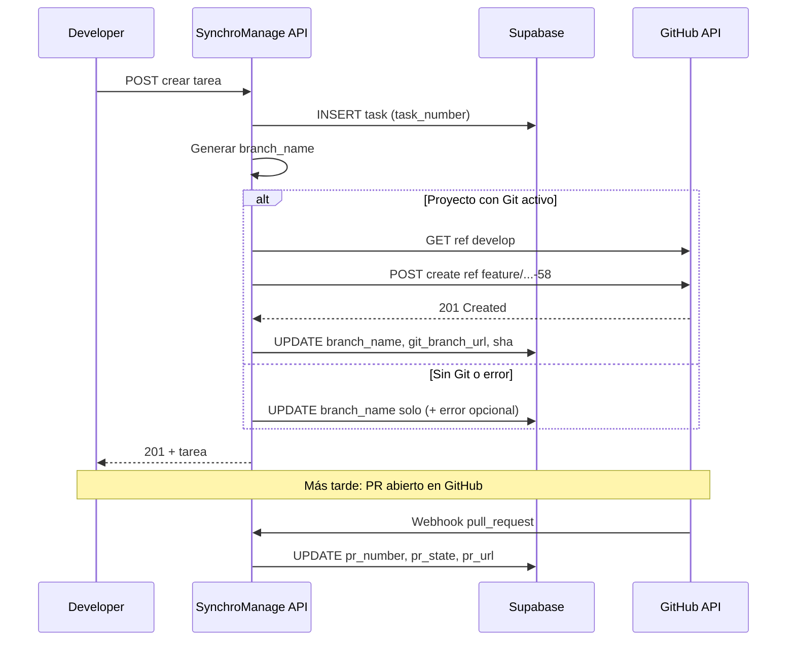

# Modelo Git — CC-22082026

## Por qué no usar la descripción del proyecto

La descripción es texto libre: no se puede validar URL, no hay API estable y el PM podría borrar el enlace por error.

**Recomendación:** sección **Integración Git** en crear/editar proyecto con campos estructurados. La descripción puede *mencionar* el repo, pero la fuente de verdad es la base de datos.

---

## Modelo de datos propuesto

### Tabla `projects` (nuevas columnas)

| Columna | Tipo | Descripción |
|---------|------|-------------|
| `git_integration_enabled` | `boolean` | Default `false` |
| `git_repo_owner` | `text` | Ej. `rubegonzalezc` |
| `git_repo_name` | `text` | Ej. `SynchroManage` |
| `git_development_branch` | `text` | Default `develop` — **base para nuevas ramas** |
| `git_production_branch` | `text` | Default `main` — producción / releases |

### Tabla `tasks` (nuevas columnas)

| Columna | Tipo | Descripción |
|---------|------|-------------|
| `branch_name` | `text` | **Ya existe** |
| `git_branch_url` | `text` | URL `tree/{branch}` en GitHub |
| `git_branch_sha` | `text` | SHA del tip al crear (opcional, auditoría) |
| `git_branch_created_at` | `timestamptz` | Cuándo se creó en remoto |
| `git_branch_error` | `text` | Último error si falló (nullable) |
| `pr_number` | `int` | Número del PR en GitHub |
| `pr_url` | `text` | URL del PR |
| `pr_state` | `text` | `open` \| `merged` \| `closed` |
| `pr_updated_at` | `timestamptz` | Última sincronización |

Índice sugerido: `(project_id)` en tasks con `pr_state` para listados futuros.

---

## Diagrama de flujo



---

## Convención de ramas (sin cambios)

Se mantiene la regla actual del producto:

```text
{categoría}/{slug-del-título}-{task_number}
```

Ejemplo: `feature/duplicar-tarea-62`

- `task_number` = `#global` del proyecto.
- La rama en GitHub se crea con el nombre exacto de `branch_name` (incluye `/` — Git lo permite).

---

## Ramas de entorno

| Rama en proyecto | Rol | Uso en SynchroManage |
|------------------|-----|----------------------|
| **Desarrollo** (`develop`) | Integración continua | **Origen** de todas las ramas de tarea |
| **Producción** (`main`) | Releases | Documentada en proyecto; no origen de ramas de tarea |

### Creación en GitHub (API)

```http
POST /repos/{owner}/{repo}/git/refs
{
  "ref": "refs/heads/feature/mi-tarea-58",
  "sha": "<sha-de-git_development_branch>"
}
```

Si la rama ya existe (409), guardar URL existente y no fallar la tarea.

---

## Campo PR en UI

### Reglas de visualización

| `pr_state` | Qué muestra la tarea |
|------------|----------------------|
| `null` / sin PR | **Nada** (sin fila, sin badge «PR») |
| `open` | `PR #12 · Abierto` (enlace) |
| `merged` | `PR #12 · Merged` (enlace) |
| `closed` | `PR #12 · Cerrado` (enlace; sin merge) |

### Cómo se detecta el PR

1. **Webhook** `pull_request` (opened, closed, reopened, synchronize) — filtrar por `head.ref === task.branch_name`.
2. **Respaldo:** al abrir detalle de tarea, `GET /repos/.../pulls?head={owner}:{branch_name}&state=all` (rate limit bajo con cache).

Un PR por rama; si hay varios, mostrar el más reciente abierto o el último merged.

---

## Enlaces en UI

| Acción | Destino |
|--------|---------|
| Clic en nombre de rama | `https://github.com/{owner}/{repo}/tree/{branch_name}` |
| Copiar | Portapapeles (`branch_name` o URL completa — definir en HU) |
| Clic en PR | `pr_url` de GitHub |

---

## Seguridad

- `GITHUB_TOKEN` solo en servidor (API Routes / Edge).
- Webhook: validar firma `X-Hub-Signature-256`.
- Roles: configurar Git en proyecto → Admin, PM (y Tech Lead si se define).
- Crear rama: mismos permisos que crear tarea.

---

## Degradación elegante

| Situación | Comportamiento |
|-----------|----------------|
| Proyecto sin Git configurado | Tarea normal; solo `branch_name` local/copiado |
| `GITHUB_TOKEN` inválido | Tarea creada; banner en proyecto «Integración Git fallida» |
| Repo no existe | Error en `git_branch_error`; botón **Reintentar crear rama** |
| Rama ya existe en GitHub | Enlazar a rama existente |

---

## Checklist desarrollador

- [ ] Clonar repo y trabajar sobre `git_development_branch` localmente.
- [ ] No crear ramas a mano desde `main` si el proyecto usa `develop`.
- [ ] PR hacia `develop` salvo acuerdo de equipo distinto.
- [ ] Citar `#global` en título del PR si el equipo lo usa en reviews.
