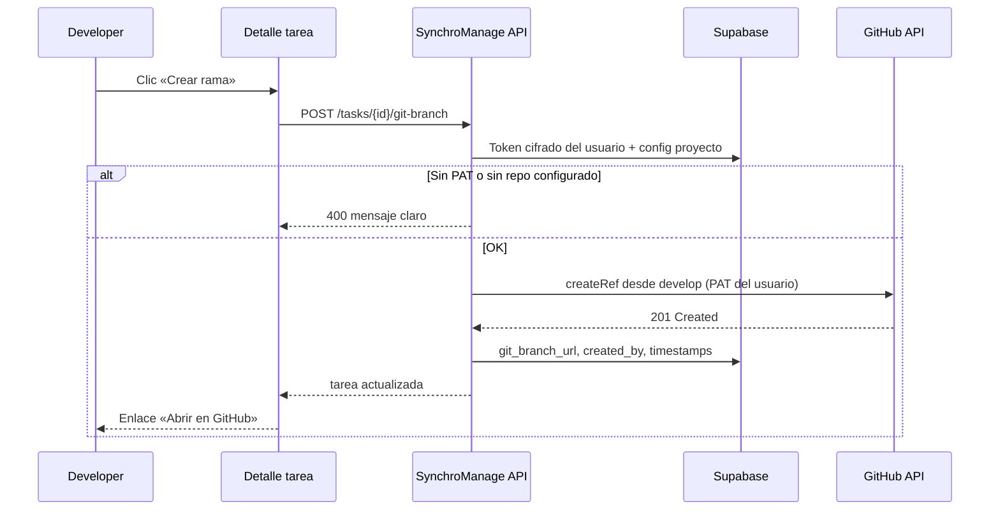

# Modelo Git — CC-22082026

## Principios de diseño

1. **Rama bajo demanda** — no se crea en GitHub al crear la tarea; el dev pulsa **Crear rama**.
2. **Token por usuario** — la API de creación usa el PAT del usuario autenticado (acción atribuida a su cuenta en GitHub).
3. **Repo por proyecto** — owner, nombre y ramas `develop` / `main` en configuración del proyecto.
4. **Nombre de rama sugerido** — `branch_name` se genera al crear la tarea (lógica existente); GitHub solo al pulsar el botón.

---

## Por qué no usar la descripción del proyecto

La descripción es texto libre. La fuente de verdad son campos estructurados en **Integración Git** del proyecto.

---

## Modelo de datos

### Tabla `projects`

| Columna | Tipo | Descripción |
|---------|------|-------------|
| `git_integration_enabled` | `boolean` | Default `false` |
| `git_repo_owner` | `text` | Ej. `rubegonzalezc` |
| `git_repo_name` | `text` | Ej. `SynchroManage` |
| `git_development_branch` | `text` | Default `develop` — base al crear rama |
| `git_production_branch` | `text` | Default `main` |

### Tabla `profiles` (nuevo)

| Columna | Tipo | Descripción |
|---------|------|-------------|
| `github_username` | `text` | @usuario en GitHub |
| `github_token_encrypted` | `text` | PAT cifrado (nunca devolver al cliente) |
| `github_connected_at` | `timestamptz` | Última conexión |

### Tabla `tasks`

| Columna | Tipo | Descripción |
|---------|------|-------------|
| `branch_name` | `text` | **Ya existe** — nombre sugerido |
| `git_branch_url` | `text` | URL tras crear en GitHub |
| `git_branch_sha` | `text` | SHA del tip al crear |
| `git_branch_created_at` | `timestamptz` | Cuándo se creó en remoto |
| `git_branch_created_by` | `uuid` | FK → profiles (quién pulsó Crear rama) |
| `git_branch_error` | `text` | Último error |
| `pr_number` | `int` | Sprint 2 |
| `pr_url` | `text` | Sprint 2 |
| `pr_state` | `text` | Sprint 2: `open` \| `merged` \| `closed` |
| `pr_updated_at` | `timestamptz` | Sprint 2 |

---

## Diagrama de flujo (crear rama manual)



---

## UI en detalle de tarea

### Antes de crear la rama en GitHub

```text
Rama    feature/login-oauth-58    [Copiar]  [Crear rama]
```

### Después de crear

```text
Rama    feature/login-oauth-58    [Copiar]  [Abrir en GitHub ↗]
PR      (vacío hasta Sprint 2)
```

### Estados del botón **Crear rama**

| Condición | Comportamiento |
|-----------|----------------|
| Usuario sin GitHub conectado | Botón deshabilitado + enlace «Conectar en Perfil» |
| Proyecto sin integración Git | Solo copiar `branch_name` |
| `git_branch_url` ya existe | Ocultar Crear rama; mostrar Abrir en GitHub |
| Error previo | Mostrar **Reintentar** + tooltip con error |
| Cargando | Spinner en botón |

---

## Convención de ramas (sin cambios)

```text
{categoría}/{slug-del-título}-{task_number}
```

Ejemplo: `feature/login-oauth-58`

---

## Autoría en GitHub

| Acción | Quién aparece en GitHub |
|--------|-------------------------|
| Crear rama (botón) | Usuario dueño del PAT |
| Commits al hacer push | Autor del `git commit` local |
| Abrir PR | Quien abre el PR en GitHub |

El token de SynchroManage **no sustituye** la identidad en commits; solo autentica la llamada API al crear la rama.

---

## Seguridad

- PAT cifrado con `ENCRYPTION_KEY` en servidor.
- Endpoint devuelve `github_connected: true/false`, nunca el token.
- Scopes mínimos: `contents:write`, `read:user` en el repo.
- Webhook PR (Sprint 2): `GITHUB_WEBHOOK_SECRET` a nivel sistema (solo lectura de eventos).

---

## Degradación elegante

| Situación | Comportamiento |
|-----------|----------------|
| Sin Git en proyecto | `branch_name` + copiar |
| Sin PAT en perfil | Aviso; tarea funciona igual |
| Rama ya existe (409) | Enlazar URL existente |
| Token expirado | Error claro; reconectar en Perfil |

---

## Checklist desarrollador

- [ ] Conectar GitHub en **Perfil** antes de usar Crear rama.
- [ ] Clonar repo y trabajar sobre `git_development_branch`.
- [ ] Crear rama desde la tarea cuando vaya a empezar código.
- [ ] PR hacia `develop` (salvo acuerdo distinto del equipo).
