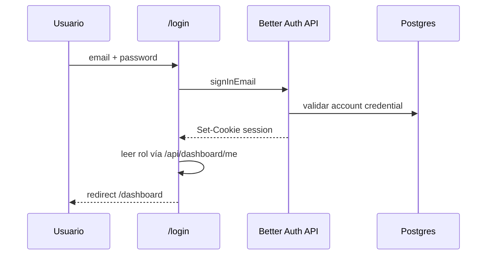
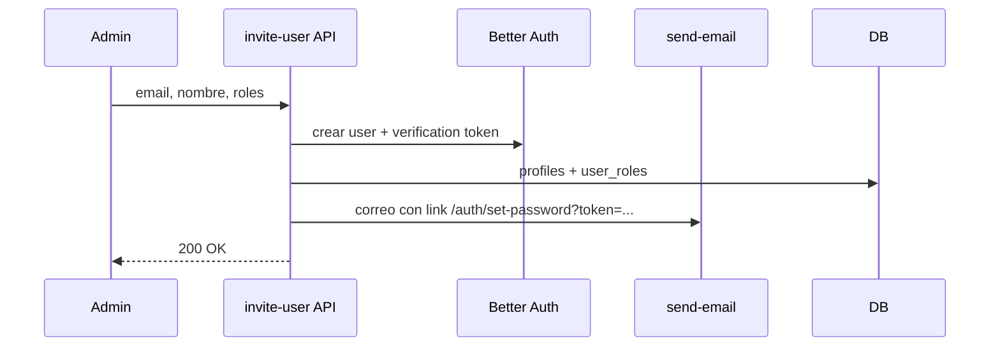
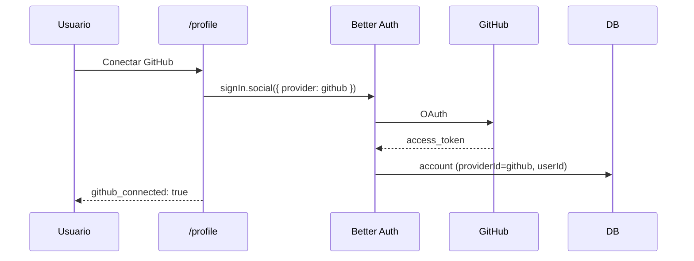

# Modelo de autenticación — CC-23082026

## Estado actual (auditoría Supabase, ago 2026)

### Proyecto

- **Ref:** `njkweyaifgqyyosungju`
- **Nombre:** SynchroManage
- **Estado:** ACTIVE_HEALTHY

### Auth

| Recurso | Valor |
|---------|-------|
| `auth.users` | 4 |
| `public.profiles` | 4 (sincronizados, 0 huérfanos) |
| `auth.identities` | 4 — proveedor **`email` únicamente** |
| `auth.sessions` | 28 activas |
| Registro público | **Deshabilitado** (`allow_user_registration = false`) |
| Verificación email | **Habilitada** |

### Creación automática de perfil

Trigger en `auth.users`:

```sql
-- Función handle_new_user() (resumen)
INSERT INTO public.profiles (id, email, full_name, role_id)
VALUES (NEW.id, NEW.email, NEW.raw_user_meta_data->>'full_name', 4);
```

La invitación admin (`POST /api/dashboard/invite-user`) usa `auth.admin.generateLink` y luego actualiza `profiles` y `user_roles`.

### Reset de contraseña

Tabla `password_reset_codes` con FK a `auth.users`. La API usa `auth.admin.updateUserById` para aplicar la nueva contraseña.

### Superficie en código

| Patrón | Alcance aproximado |
|--------|-------------------|
| `supabase.auth.getUser()` | ~51 archivos |
| `SUPABASE_SERVICE_ROLE_KEY` en APIs | ~41 rutas |
| `auth.admin.*` | invite, resend-invite, delete-user, users list, password-reset |

### RLS y `auth.uid()`

Las políticas de `profiles`, `tasks`, `comments`, etc. usan `auth.uid()` y funciones `is_admin()`, `get_user_role()`.

Las **API routes** ya operan con `service_role`, por lo que el cambio de auth impacta principalmente:

1. Middleware y layouts (sesión).
2. Cliente Supabase directo (Realtime notificaciones, lecturas de perfil en login).
3. Políticas RLS si el cliente sigue usando anon key con JWT de sesión.

---

## Estado objetivo

### Principios

1. **Better Auth** es la única fuente de verdad para identidad y sesión.
2. **Supabase Postgres** se mantiene; solo se deja de usar **Supabase Auth**.
3. **`profiles.id`** conserva el UUID existente (misma PK que hoy).
4. **GitHub OAuth** se registra en Better Auth (`account` provider), no en Supabase.
5. Las APIs siguen el patrón **verificar sesión → operar con service_role** (sin regresión).

### Tablas Better Auth (nuevas en `public` o schema dedicado)

Better Auth genera migraciones para tablas equivalentes a:

| Tabla | Propósito |
|-------|-----------|
| `user` | id, email, name, emailVerified, image, createdAt, updatedAt |
| `session` | token, userId, expiresAt, ip, userAgent |
| `account` | providerId (`credential`, `github`), tokens OAuth, userId |
| `verification` | tokens de verificación / invitación |

> **Decisión de IDs:** en la migración de datos, `user.id` de Better Auth = `profiles.id` actual (UUID). Así no se rompen FKs de negocio.

### Relación con `profiles`

```text
better_auth.user.id  ═══  profiles.id  (mismo UUID)
profiles.role_id, company_id, full_name, avatar_url  →  sin cambios de modelo
user_roles  →  sin cambios
```

El trigger `handle_new_user` en `auth.users` se **elimina** tras el cutover. La creación de perfil pasa a un hook post-registro de Better Auth (invitación o signup admin).

### `password_reset_codes`

- Cambiar FK: `user_id` → `user.id` (Better Auth) en lugar de `auth.users`.
- O mantener UUID sin FK estricta (mismo valor); preferible FK a `user` para integridad.

---

## Estrategia RLS

### Opción elegida: APIs con service_role + cliente sin JWT Supabase

| Capa | Comportamiento |
|------|----------------|
| **Middleware / API** | `auth.api.getSession()` de Better Auth |
| **APIs de datos** | Siguen con `service_role` (sin cambio) |
| **Cliente Supabase directo** | Migrar lecturas sensibles a API routes o deshabilitar dependencia de `auth.uid()` en cliente |

### Realtime (notificaciones)

Hoy el cliente puede suscribirse con sesión Supabase. Tras la migración:

- **Opción A (recomendada):** Realtime solo vía API + polling/SWR (ya usado en gran parte).
- **Opción B:** Emitir JWT custom compatible con Supabase (complejidad alta; fuera de alcance inicial).

### Políticas con `auth.uid()`

No reescribir todas las políticas en este CC. Mientras el cliente no dependa de anon+JWT Supabase para escrituras, las políticas actuales quedan como defensa en profundidad. Documentar en cutover que acceso directo PostgREST con anon key **no** debe usarse para mutaciones.

---

## Flujos migrados

### Login



### Invitación (reemplazo generateLink)



### Reset contraseña

Sin `auth.admin.updateUserById`:

1. Generar código en `password_reset_codes` (como hoy).
2. Verificar código.
3. `auth.api.resetPassword` o update directo del hash en `account` (Better Auth).

### GitHub OAuth (Sprint 3 — puente a CC-22082026)



CC-22082026 usará el `access_token` de la cuenta GitHub vinculada para `POST /tasks/{id}/git-branch`, con fallback opcional a PAT cifrado manual.

---

## Migración de usuarios existentes (4 usuarios)

### Script de cutover (ventana de mantenimiento corta)

1. Exportar de `auth.users`: `id`, `email`, `encrypted_password`, `email_confirmed_at`, metadata.
2. Insertar en tablas Better Auth:
   - `user` con mismo `id` y `emailVerified`.
   - `account` con `providerId = 'credential'` y hash compatible (Better Auth soporta importación bcrypt de Supabase).
3. Verificar login con contraseña existente para cada usuario.
4. Desactivar Supabase Auth en dashboard (o dejar de usar en código).
5. Eliminar trigger `on_auth_user_created` y función si ya no aplica.

### Rollback

- Mantener backup de `auth.users` y snapshot DB antes del cutover.
- Feature flag `AUTH_PROVIDER=supabase|better-auth` durante Sprint 1–2 en staging solamente; en producción cutover atómico en Sprint 3.

---

## Limpieza post-migración

| Eliminar / dejar de usar | Mantener |
|--------------------------|----------|
| `@supabase/ssr` para auth | `@supabase/supabase-js` con service_role en APIs |
| `supabase.auth.getUser()` en todo el repo | Cliente Supabase para Storage (avatars) si aplica |
| `auth.admin.generateLink`, `listUsers`, `deleteUser` | `profiles`, `roles`, `user_roles` |
| Trigger `on_auth_user_created` | Edge Function `send-email` |
| Cookie `user_role` cache (opcional: recalcular desde API) | Middleware de rutas protegidas (reimplementado) |

---

## Seguridad

- `BETTER_AUTH_SECRET` solo en servidor; rotación documentada.
- GitHub OAuth: scopes mínimos `read:user`, `repo` (o `contents:write` según CC-22082026).
- No exponer `access_token` de GitHub al cliente; solo flag `github_connected`.
- Habilitar protección de contraseñas filtradas en Better Auth / validación server-side.
- Corregir en paralelo (ticket aparte): RLS en `task_categories`, restricción RPC `is_admin()` a `service_role`.

---

## Checklist de cierre CC-23082026

- [ ] Cero referencias a `supabase.auth` en `src/`
- [ ] Login, invite, reset, delete user funcionan
- [ ] 4 usuarios migrados y verificados
- [ ] GitHub conectable desde perfil (OAuth)
- [ ] CC-22082026 desbloqueado para Sprint 1
